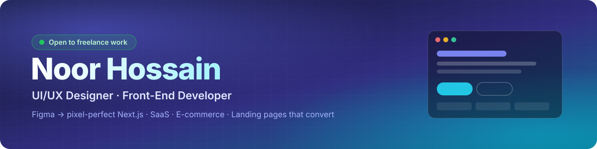

<!-- ============ HEADER ============ -->
<p align="center">
  
</p>

<p align="center">
  <a href="https://www.linkedin.com/in/noorxtk/"></a>
  <a href="https://wa.me/8801913264543"></a>
  <a href="https://www.behance.net/noorxtk"></a>
  <a href="https://twitter.com/noorxtk"></a>
  <a href="https://dribbble.com/Noorxtk"></a>
  <a href="https://www.pinterest.com/noorxtk/"></a>
</p>

<p align="center">
  
  
  
</p>

---

### 👋 Hi, I'm Noor

I'm a **UI/UX designer who ships the code too**. I take products from user flow and wireframe to a polished Figma system — then build it as a fast, responsive, accessible front end.

I care about one thing: **interfaces that look premium *and* move metrics** — clearer journeys, fewer drop-offs, higher conversion.

- 🎨 **Design** — UX research, user flows, wireframes, high-fidelity UI, design systems & tokens
- 💻 **Build** — Next.js, React, TypeScript, Tailwind CSS, Framer Motion, WordPress / WooCommerce
- 🛒 **Commerce** — I run my own WooCommerce store, so I design checkout and product pages from real sales data, not guesswork
- 📈 **Growth** — Landing pages, ad creatives and CRO for paid traffic (Meta & Google Ads)

---

### 🧰 Toolkit

<p align="center">
  
</p>

<table align="center">
<tr>
<td valign="top" width="33%">

#### 🎨 Design


</td>
<td valign="top" width="33%">

#### 💻 Front-end


</td>
<td valign="top" width="33%">

#### 🚀 CMS · Ship · Grow


</td>
</tr>
</table>

---

### 🚀 Featured Work — Landing Pages & SaaS Websites

| Project | What it is | Live |
|---|---|---|
| **[WorkUp — Project Management SaaS](https://github.com/nooruiux/Project-Management-SaaS-Website)** | SaaS landing page: feature storytelling, pricing and trial-focused CTAs. Pixel-perfect from Figma. `Next.js` `TypeScript` `Tailwind` | [Demo ↗](https://project-management-saa-s-website.vercel.app) |
| **[Quantum — AI Content Writing](https://github.com/nooruiux/Content-Writing-AI-Website)** | Dark AI SaaS landing page with product mockups, integrations and pricing. `Next.js 16` `React 19` `Tailwind v4` | [Demo ↗](https://content-writing-ai-website.vercel.app) |
| **[Lumino — Crypto Mining Platform](https://github.com/nooruiux/Cryptocurrency-Website)** | Bitcoin mining site with live profit calculator and trust-first dark UI. `Next.js` `TypeScript` `Framer Motion` | [Demo ↗](https://cryptocurrency-website-development.vercel.app) |
| **[Gymnastic — Fitness Training](https://github.com/nooruiux/Fitness-Training-Website)** | Gym website: classes, memberships, trainer profiles and sign-up flow. `Next.js` `TypeScript` `Tailwind` | [Demo ↗](https://fitness-training-website-bay.vercel.app) |
| **[GadgetMart 140W Charger Landing Page](https://github.com/nooruiux/140W-Charger-Separator-Landing-Page)** | CRO-focused e-commerce product landing page running live on WooCommerce. `HTML` `CSS` `JS` | [Live ↗](https://gadgetmart.com.bd/140w-fast-charger-separator/) |

> 🖼️ Full case studies (research → wireframes → final UI) live on **[Behance](https://www.behance.net/noorxtk)**.

---

### 🧭 How I Work

```
Discover  →  Define  →  Design  →  Build  →  Ship & Measure
  goals,       flows,      Figma       Next.js /     Vercel deploy,
  users,       wireframes, system +    WordPress,    Lighthouse,
  analytics    IA          hi-fi UI    accessible    CRO iterations
```

**Standards on every build:** mobile-first · WCAG 2.1 AA contrast & keyboard nav · semantic HTML for SEO · 90+ Lighthouse target · reusable components & design tokens.

---

### 🤝 Let's Work Together

I take on **UI/UX design, Figma-to-code, landing pages, SaaS marketing sites and WooCommerce stores**.

<p>
  <a href="https://wa.me/8801913264543?text=Hi%20Noor%2C%20I%20saw%20your%20GitHub%20and%20want%20to%20discuss%20a%20project."></a>
  <a href="https://www.linkedin.com/in/noorxtk/"></a>
  <a href="https://www.behance.net/noorxtk"></a>
</p>

<p align="center">
  <sub>Designed & built by Noor Hossain · Dhaka, Bangladesh</sub>
</p>
